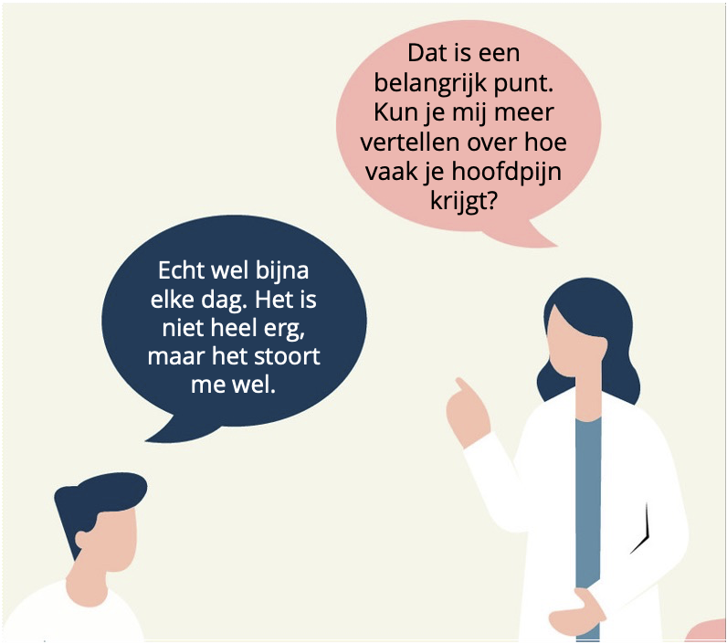

# *Generating High Quality Synthetic Data for Dutch Medical Conversations*

     
   

Repository for paper ***Generating High Quality Synthetic Data for Dutch Medical Conversations***

Authos: Cecilia Kuan, Aditya Kamlesh Parikh, Henk van den Heuvel

Affiliation: Radboud University, The Netherlands

*Paper accepted at LREC 2026.*

**Dataset and examples:**
* [Dataset generated for evaluation](https://doi.org/10.34973/mvpm-9987)
* [Sample - generated text dialogue](./sample_generated_text_diallgue.pdf)

***
## *Current Development* ##
Synthetic text dialogues used for synthesizing audio dialogues:
* [Demo - audio Dutch medical dialogue](./synthetic_audio_dialogue_sample.wav)
* [Audio demo transcript](./demo_audio_dialogue_demo_transcript.pdf)

---
Image source: vecteezy.com
